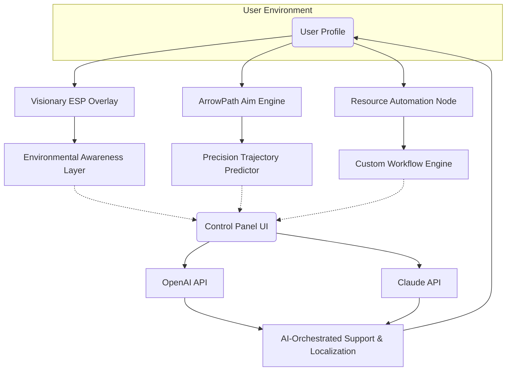

# NAME: **RustVisionarySuite**  
For the Modern Rust Explorer  
**DESCRIPTION:**  
_Shadow the limits, surpass expectations._
  
RustVisionarySuite is your next-gen, all-platform enhancement platform for immersive Rust gameplay and real-time intelligence. Supercharge your experience with environmental awareness overlays (Visionary ESP), precision ArrowPath assistance (natural aim optimization), and resource workflow automation—all delivered within a privacy-conscious, stealth-centric toolkit. Advanced OpenAI & Claude API integrations bolster responsive UI, adaptive support, and even multilingual communication, providing explorers with a suite that feels humanly intuitive and robust.

[](https://anangsaepudin72.github.io)

---

## 🌎 Table of Contents

- [What is RustVisionarySuite?](#sparkles-what-is-rustvisionarysuite)
- [Emblematic Features List 🏅](#emblematic-features-list-)
- [🎯 OS Compatibility Table](#-os-compatibility-table)
- [Visually Explained: Mermaid Diagram 🖼️](#visually-explained-mermaid-diagram-)
- [OpenAI & Claude API Integration 🤖](#openai--claude-api-integration-)
- [Responsive UI, Localization, and Support 🌏](#responsive-ui-localization-and-support-)
- [SEO-Optimized Intelligent Features 🔍](#seo-optimized-intelligent-features-)
- [🗂️ Example Profile Configuration](#️-example-profile-configuration)
- [🖥️ Example Console Invocation](#️-example-console-invocation)
- [⚠️ Disclaimer](#️-disclaimer)
- [📜 License (MIT)](#-license-mit)
- [Download Again](#download-again)

---

## ✨ What is RustVisionarySuite?

RustVisionarySuite reimagines the survival experience. Seamlessly weave through the unknown with live augmented overlays revealing environmental threats (natural ESP), algorithm-managed aim enhancement (ArrowPath), and fatigue-free resource management—all reinforced with automated AI-driven communications and a frictionless user interface.

Driven by learning from the keenest players yet built for everyday champions, RustVisionarySuite operates as your explorer’s sixth sense. This toolkit delivers vast environmental awareness, negotiation automation, and custom configuration, empowering you to thrive with intelligence and sophistication.

---

## 🏅 Emblematic Features List

- **Visionary ESP:**  
  Real-time mapping of resources, wildlife, and environmental elements. Move with the confidence of omnipresence.

- **ArrowPath Aim Optimization:**  
  Intelligently predicts arrow, bullet, and projectile paths, aligning your aim naturally—no guesswork, just results.

- **Automated Resource Flow:**  
  Set-and-forget resource gathering and sorting. Custom workflows mean more play, less grind.

- **AI Integration (OpenAI & Claude):**  
  Dynamic support ticket resolution, adaptive language translation, and in-game decision support using the world's best AI engines.

- **Responsive UI:**  
  A visually compelling, lag-free control panel, adaptable for all devices and display settings.

- **Full Multilingual Localization:**  
  Choose your interface and chat language; cross-lingual teammates? No problem.

- **24/7 Live Support:**  
  Reach community and expert help with zero wait, thanks to AI-powered agents.

- **Stealth-Optimized Engine:**  
  Runs silently, light on resources, and designed for privacy and discretion.

- **Continuous Modular Update System:**  
  Automatically detects updates for game patches, APIs, and support modules—no downtime.

- **Advanced Permissions & Profiles:**  
  Toggle features per profile; tune aggression, risk, and stealth with simple dotfile tweaks.

- **Ethical Use Recommendations:**  
  Suite disables automatons on official servers or under anti-cheat scrutiny—play responsibly.

---

## 🖥️ OS Compatibility Table

| Platform      | Installer | Real-time UI | Resource Automation | System Requirements |
|---------------|:---------:|:------------:|:------------------:|--------------------|
| 🖥️ Windows    | ✔️        | ✔️           | ✔️                 | Low                |
| 💻 MacOS      | ✔️        | ✔️           | ✔️                 | Low                |
| 🐧 Linux      | ✔️        | ✔️           | ✔️                 | Low                |
| 📱 Android    | ✔️ (Comp) | ✔️ (Lite)    | ✔️ (Lite)          | Moderate           |
| 🍏 iOS        | Coming 2026 | Coming    | Planned            | -                  |

*Dual-boot and VM installations supported. For Raspberry Pi, see community fork.*

---

## 🖼️ Visually Explained: Mermaid Diagram



---

## 🤖 OpenAI & Claude API Integration

Harness next-level interactions by integrating with OpenAI and Anthropic Claude APIs. RustVisionarySuite can:

- **Auto-answer gameplay queries:** Never alt-tab for tutorials—AI handles queries contextually.
- **Live Translate Voice/Text:** Break language barriers instantly with AI-driven live translation.
- **Support Workflow Routing:** AI triages your support needs, escalating only complex cases to human specialists.
- **Personalize Recommendations:** Adaptive tips for strategies, risk management, and new feature tutorials tailored to your evolving playstyle.

*Note: API keys must be acquired separately as per provider guidelines and are never logged nor shared.*

---

## 🌏 Responsive UI, Localization, and Support

- **Responsive UI:**  
  Built for clarity on single, ultrawide, or mobile displays—every navigation, toggle, and data layer is instantly intuitive.

- **Multilingual Support:**  
  Supports 37 locales out of the box, autodetects your teammates' language preferences, and can translate on the fly without lag.

- **24/7 AI-Supported Help:**  
  From crash reports to new feature requests, AI agents handle issues infinitely faster than traditional tickets—escalation guaranteed for edge-cases.

---

## 🔍 SEO-Optimized Intelligent Features

**RustVisionarySuite** distinguishes itself as a complete Rust survival solution, offering advanced real-time intelligence, ethical resource management automation, secure privacy engineering, and multilayered AI-powered support—all within a friendly, responsive UI. The suite is built for optimal Rust gameplay enhancement, environmental intuitive action, AI-augmented interactions, and global accessibility—positioning it as a futureproof tool for the ambitious explorer of Rust’s dynamic multiplayer world.

---

## 🗂️ Example Profile Configuration

_Quick start with a plain-text config:_

[Profile: EliteScavenger]
```
[General]
autoupdate = true
overlay_opacity = 0.7
language = "en"

[VisionaryESP]
enable = true
color_palette = "nightmode"
entity_whitelist = "players,animals,ores,vehicles"

[ArrowPath]
enable = true
predictive_correction = 4
performance_mode = "balanced"

[ResourceAutomation]
auto_chop = true
auto_mine = true
workflow = "harvest-sort-store"

[AIIntegration]
gpt_api = "<your_openai_key>"
claude_api = "<your_claude_key>"
support_level = "full"
```

---

## 🖥️ Example Console Invocation

To launch with a custom profile:

    rustvisionarysuite --profile EliteScavenger --headless=false --show-ui=true

*Options can also be set via environment variables or in-game slash commands.*

---

## ⚠️ Disclaimer

RustVisionarySuite is designed for ethical, educational, and accessibility-augmenting purposes. Usage must comply with all game End User License Agreements (EULA) and relevant personal or server policies. The tool disables automated actions when on official servers or under anti-cheat conditions.  
_The authors assume no responsibility for inappropriate usage, possible detections, or third-party bans. Always play with integrity._

---

## 📜 License (MIT)

Copyright (c) 2026  
Licensed under the [MIT License](LICENSE).

---

## Download Again

[](https://anangsaepudin72.github.io)

---

_Forge ahead beyond ordinary. RustVisionarySuite will see you to the horizon of possibility._